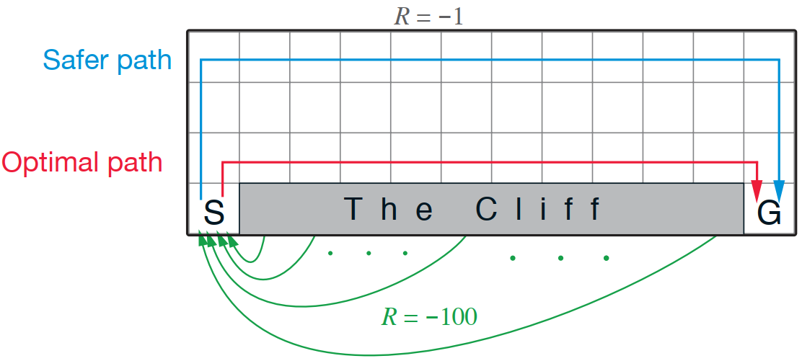
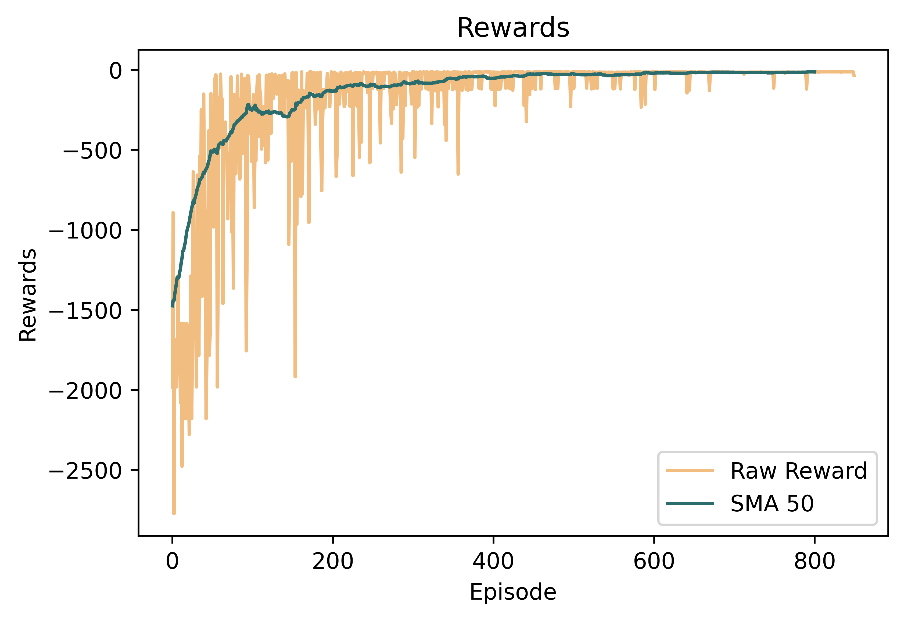
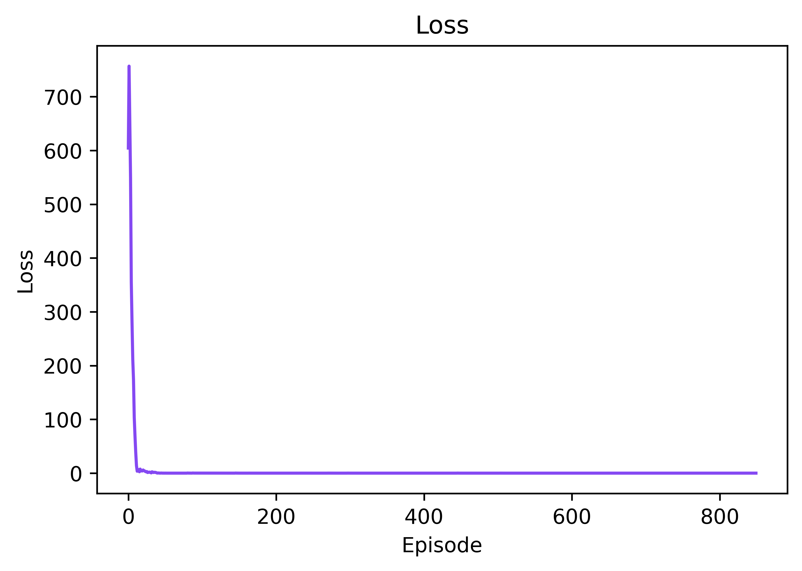

## Description
Welcome to this repository! Here, you'll find a Python implementation of the Deep Q-Network (DQN) algorithm, a significant breakthrough in Deep Reinforcement Learning (DRL). This repository illustrates the effectiveness of the DQN algorithm by applying it to the [Cliff Walking v0](https://gymnasium.farama.org/environments/toy_text/cliff_walking/)  environment provided by the Gymnasium library. In this environment, the agent's objective is to navigate a grid map where stepping on certain tiles (cliffs) results in immediate failure. Thus, the agent has to efficiently traverse the grid from the starting point to the goal point while avoiding the cliffs. The details of the Cliff Walking environment is ilusstrated in the following figure [[1]](#1). This setup simulates scenarios where risky decisions can lead to catastrophic outcomes, emphasizing the importance of strategic decision-making in reinforcement learning. This implementation not only serves as a valuable resource for enthusiasts and practitioners seeking to understand and apply DQN in their projects and pave the way for further experimentation.

  

## Deep Q-Network (DQN)
The DQN algorithm is a value-based, model-free, and off-policy approach renowned for its capacity to learn optimal policies from high-dimensional input spaces. Originating from the efforts of researchers at DeepMind, DQN merges deep neural networks with traditional Q-learning to approximate the optimal state-action value function (Q function). The major pros and cons of the algorithm are as follows:

###### Advantages:
1. 	**Experience Replay Memory:** By utilizing exploration strategies like the epsilon-greedy policy and employing techniques such as experience replay, DQN significantly enhances sample efficiency and stabilizes the learning process for its main policy. This approach allows the algorithm to learn more effectively from past experiences and facilitates smoother convergence toward optimal policies.

###### Disadvantages:
1. 	**Hyperparameter Sensitivity:** DQN performance relies on tuning many hyperparameters, which makes it challenging to achieve optimal results in different environments.

2. 	**Training Instability:** During training, DQN may encounter instability, primarily originating from the dynamic nature of the target network. Furthermore, performance collapse can occur, presenting a scenario where DQN struggles to recover through learning, potentially hindering its training progress.

## Solution
The main focus of solving the Cliff Walking environment lies in the discrete and integer nature of the observation space. The observation space of the Cliff Walking environment consists of a single number from 0 to 47, representing a total of 48 discrete states. To address this, we should encode the state into a one-hot vector. This encoding transforms each discrete observation into a binary vector, where only one element is set to 1, representing the observed state. By doing so, we enable the neural network of the DQN to learn from more features represented by these one-hot vectors rather than solely relying on individual integers. This approach enhances the network's ability to capture the underlying structure of the environment and facilitates more effective learning, ultimately leading to improved performance in navigating the Cliff Walking environment.

## Requirements
The code is implemented in Python 3.8.10 and has been tested on Windows 10 without encountering any issues. Below are the non-standard libraries and their corresponding versions used in writing the code:
<pre>
gymnasium==0.29.1
matplotlib==3.5.1
numpy==1.22.0
pygame==2.5.2
torch==2.0.1+cu118
</pre>

**Note:** This repository uses the latest version of Gymnasium for compatibility and optimization purposes. This code does not utilize any deprecated or old versions of the Gym library.

## Usage
The network final weights are pre-saved in the root directory `./final_weights_800.pth`. There is no need to initiate training from the beginning for testing the code. Upon executing the code, the weights will automatically be loaded, allowing seamless rendering and testing. Have fun in the environment! 

## Showcase
You can view the training procedure through the following GIFs, demonstrating the learned process across episodes.

**Note:** The training process spanned 850 episodes to ensure complete plotting for analysis, despite the agent reaching a convergent point as early as episode 200.

  
  

  
  

#### Results
Below is a summary of the training outcomes over 850 episodes. The plots encompass the raw rewards obtained with the Simple Moving Average of 50 rewards (SMA 50) alongside the network loss during training.

  
  

The initial surge in network loss is due to the -100 rewards received while stepping the cliff during training, leading to gradient explosion, which is addressed by clipping the gradient norm during the learning phase.

## Persian Tutorial Video
[Here](https://youtu.be/EMQI5fufdsI) is a video tutorial in Persian that delves into the implementation, covering general points, personal experiences, and details of the environment.

I genuinely hope this repository proves valuable to those on the learning path. If you find this repository beneficial in your journey, consider fueling this work by endorsing it.

## Beyond Cliff Walking
Explore my solutions for various environments within the Gymnasium library, each presenting captivating challenges that showcase the exciting applications of deep reinforcement learning techniques. Some of these solved environments include:

###### Toy Text Environments:
1. [Frozen Lake v1](https://github.com/MehdiShahbazi/DQN-Frozenlake-Gymnasium) &#8594; Solved with DQN algorithm

###### Classic Control Environments:
1. [Mountain Car v0](https://github.com/MehdiShahbazi/DQN-Mountain-Car-Gymnasium) &#8594; Solved with DQN algorithm
2. [Cart Pole v1](https://github.com/MehdiShahbazi/REINFORCE-Cart-Pole-Gymnasium) &#8594; Solved with REINFORCE algorithm

## References

-  [Sutton, R.S. and Barto, A.G., 2018. Reinforcement learning: An introduction. MIT press.](http://www.incompleteideas.net/book/RLbook2020.pdf)
